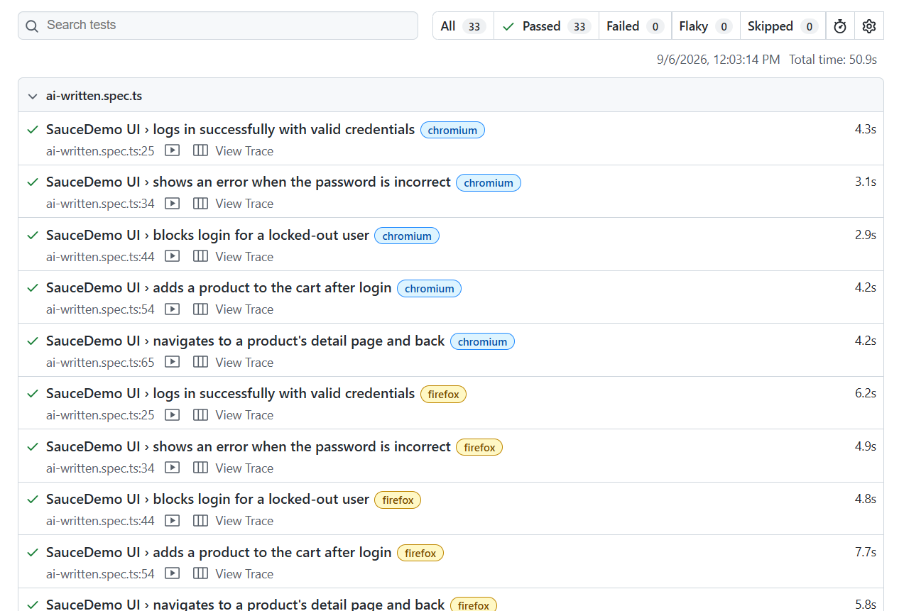
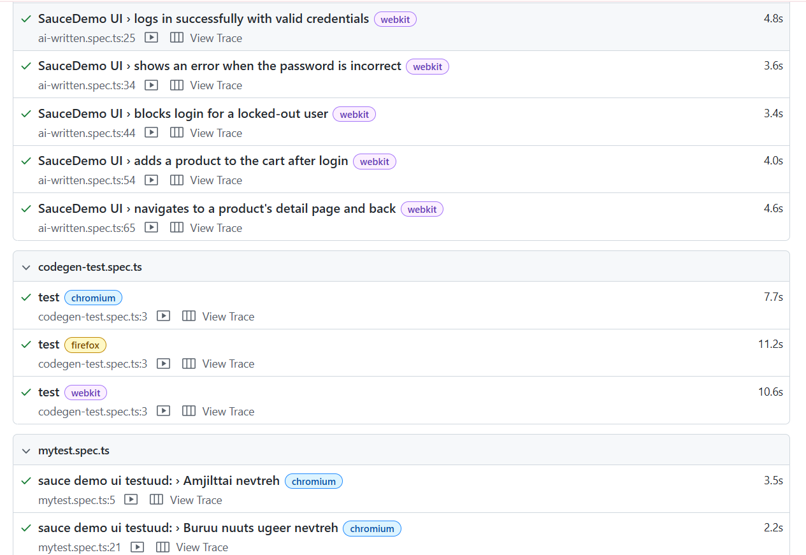
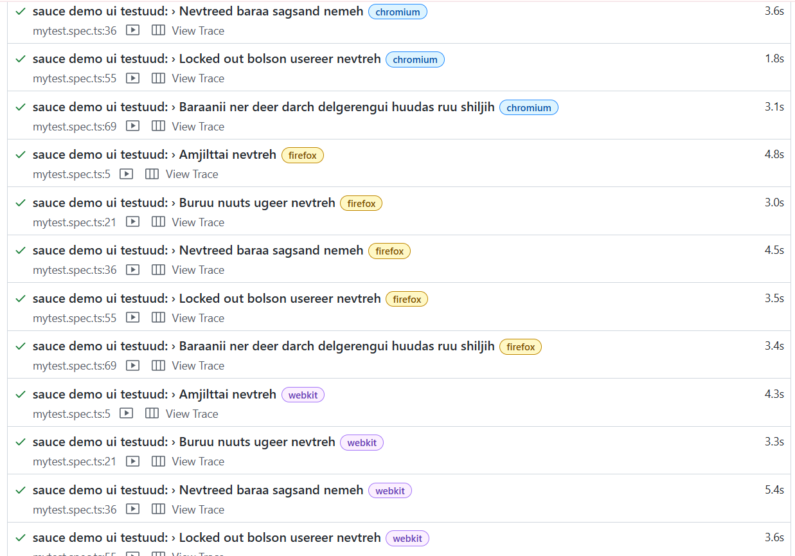

# Playwright UI Test - Lab 1

Энэ лабораториор Playwright ашиглаад https://www.saucedemo.com сайт дээр UI автомат тестүүд бичиж үзлээ.

# Оюутны нэр, код: Т.Мөнхцэцэн /B232270025/

## Хийсэн зүйлс

1. WSL (Ubuntu) орчноо бэлдэж Node.js болон Playwright-аа суулгасан. Linux дээр сангууд дутаад байсан тул `npx playwright install-deps` command-р шаардлагатай багцуудыг гүйцээж суулгасан.
2. `tests/mytest.spec.ts` файл дотор дараах 5 тестийг бичсэн:
   - Амжилттай нэвтрэх болон менюгээс буцаад Logout хийх
   - Буруу нууц үг хийхэд алдааны текст гарж байгааг шалгах
   - Бараа сагсанд нэмэхэд сагсан дахь бүтээгдэхүүний тоо 1 болж өөрчлөгдөх
   - Блоклуулсан хэрэглэгчээр (`locked_out_user`) нэвтрэхэд алдаа зааж байгааг шалгах
   - Барааны нэр дээр дарж дэлгэрэнгүй хуудас руу орж шалгах
3. `codegen` ажиллуулж код автоматаар бичүүлж үзсэн. Мөн `show-report` болон Trace Viewer ашиглаж тест ажиллах үеийн бичлэг, алхам бүрийн зургийг харж шалгасан.

---

## Playwright болон Selenium-ийг харьцуулж ажигласан зүйлс

Selenium ашиглахад элемент гарч ирэхийг хүлээхийн тулд заавал гараар explicitly wait бичих шаардлага гардаг. Харин Playwright нь цаанаасаа `auto-wait` хийдэг тул код бичихэд амар, хурдан бөгөөд тест шалтгаангүйгээр унах нь бага байдаг.

Мөн Selenium дээр хөтөч бүрд тохирсон driver суулгаж тохируулдаг бол Playwright дээр ганц command-р бүх browser нь шууд суучихдаг нь их амар санагдлаа. Ялангуяа Trace Viewer нь тест яг ямар алхам дээр унасныг видео болон DOM snapshot-оор нь ухарч харах боломж олгодог тул debug хийхэд Selenium-аас хамаагүй практиктай юм байна. XPath ашиглахаас илүү `getByRole`, `getByPlaceholder` зэрэг хэрэглэгчийн хардаг текстээр элемент олох нь веб хуудасны бүтэц өөрчлөгдөхөд код эвдрэхээс сэргийлнэ.

### XPath-аас яагаад зайлсхийсэн бэ?

Учир нь веб хуудасны DOM бүтэц, HTML tag эсвэл class өөрчлөгдөхөд XPath дээр суурилсан тест шууд унадаг. Тиймээс `getByRole`, `getByPlaceholder`, `getByTestId` зэрэг хэрэглэгчийн дэлгэц дээр харж байгаа бодит элемент дээр тохируулсан locator-уудыг ашигласан.

### Codegen-ийн код миний кодоос юугаараа ялгаатай байсан бэ?

`npx playwright codegen` ажиллуулахад миний хийсэн үйлдэл бүрийг код болгон үүсгэж байсан.

---

## Тест ажиллуулсан үр дүн





## AI туслах ашигласан туршилт ба дүгнэлт

Энэ лаборатори дээр Claude ai ашиглаж кодоо илүү сайжруулж бичүүлж үзлээ. Анх миний бичсэн код тест бүр дээр нэг ижил үйлдлийг дахин дахин бичсэн байсан бол AI үүнийг `login`, `logout` гэсэн тусдаа функц болгож салгаад, хэрэглэгчдийн мэдээллийг `USERS` объектод нэгтгэн кодын давхардлыг маш сайн арилгаж өгсөн.

Мөн миний хэлж өгсний дагуу нэвтэрч чадаагүй тестүүд дээр `logout` хийх гэж гацахгүй байхаар логикийг нь тааруулж, Playwright-ийн `getByRole`, `getByPlaceholder` гэсэн зөв locator-уудыг ашигласан байна. AI-ийн гаргаж өгсөн бүтцийг шууд хуулалгүйгээр кодоо нэг бүрчлэн шалгаж, `npx playwright test`-ээр ажиллуулж бүх тест ногоон зааж байгааг баталгаажуулж авсан. Энэ туршилтаар AI туслах нь шинээр код бичихээс илүүтэй бичсэн кодоо цэгцлэх, рефакторинг хийж архитектурыг нь сайжруулахад маш хэрэгтэй туслах болж чаддагийг ойлголоо.

## Тест ажиллуулах

```bash
# Багцуудыг суулгах
npm install

# Тест ажиллуулах
npx playwright test

# Тайлан харах
npx playwright show-report


```
